

<!-- typing hero — statement not buzzwords -->

<!-- social + nav -->

<!-- pill nav — anchor only, no CSS hiding, always works -->

<!-- ============================================================ -->
<h3 id="01--about">01 — about &nbsp;systems, not just models</h3>

> 🧠 ML/Data Science focused on systems, not just models  
> ⚙️ Design pipelines that turn data into decisions  
> 📊 Real-world data & production constraints  
> 🤖 Automation and decision engines

I build the parts that make ML useful in production — **ingest, validation, observability, and the decision layer**. Models sit in the middle. *Pipelines are the product.* I optimize for latency, cost, and drift, not just accuracy.

<table>
<tr>
<td width="50%" valign="top">

**What I do**
 
Ship end-to-end flows <code>Ingest → Validate → Model → Deploy → Monitor</code>. Close the loop so feedback becomes the next dataset.

</td>
<td width="50%" valign="top">

**What I'm exploring**
 
Agentic research workflows, RAG over private knowledge, and decision engines that run without babysitting.

</td>
</tr>
</table>

<code>real data > toy datasets</code> <code>constraints are features</code> <code>ship → measure → iterate</code> <code>automate the toil</code> <code>observable by default</code>

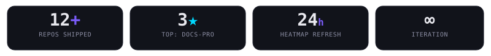

<!-- ============================================================ -->
<h3 id="02--stack">02 — stack &nbsp;the pipeline toolkit</h3>


 

  

<!-- curated shields — not a wall, just the essentials -->

 

 

Python-first. TS for shipping. SQL for truth. The stack serves the pipeline — not the other way around.


<!-- ============================================================ -->
<h3 id="03--system">03 — system &nbsp;how I build</h3>

 
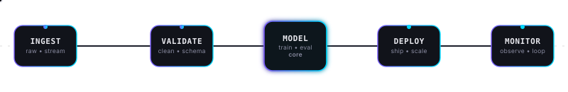

<table>
<tr>
<td width="20%" valign="top"><code>01 ingest</code> <b>Capture reality</b> APIs / streams / scrapes. Idempotent, backfillable, schema-aware since day one.</td>
<td width="20%" valign="top"><code>02 validate</code> <b>Trust is a check</b> Contract tests & anomaly gates. Bad data never poisons the model.</td>
<td width="20%" valign="top"><code>03 model</code> <b>Models are the middle</b> Baseline → improve → retire. Eval on prod slices, version everything.</td>
<td width="20%" valign="top"><code>04 deploy</code> <b>Ship small</b> Feature flags, canaries, shadow traffic. The best model is the one serving.</td>
<td width="20%" valign="top"><code>05 monitor ↺</code> <b>Close the loop</b> Drift / latency / cost on one dashboard. Feedback → next ingest.</td>
</tr>
</table>

> Built for **real-world constraints** — not notebooks. Latency budgets, dirty data, and stakeholder deadlines are inputs, not excuses.

<!-- ============================================================ -->
<h3 id="04--work">04 — work &nbsp;selected builds</h3>

<!-- pin cards — transparent dark, no neon clutter -->

<table>
<tr>
<td width="50%" valign="top">

**documentation-pro** · Shell · ★3
 
Opinionated docs-as-code system — generate, lint, and ship handbooks like you ship software.
 

`docs-as-code` `automation` `DX`

</td>
<td width="50%" valign="top">

**fcuk-paywalls** · TypeScript
 
FCUK PAYWALLS — open index of no-signup, in-browser, open-source tools. No accounts. No walls.
 

`open-source` `no-signup` `tooling`

</td>
</tr>
</table>

More → <a href="https://github.com/vaibhxvvy/portfolio"><code>portfolio</code></a> <a href="https://github.com/vaibhxvvy/agentic-research-assistant"><code>agentic-research-assistant</code></a> <a href="https://github.com/vaibhxvvy/rag-knowledge-assistant"><code>rag-knowledge-assistant</code></a> · <a href="https://github.com/vaibhxvvy?tab=repositories">all repos →</a>

<!-- ============================================================ -->
<h3 id="05--stats">05 — stats &nbsp;activity</h3>

 

  

 

<!-- 3D heatmap — generated daily via 3d-heatmap.yml -->

  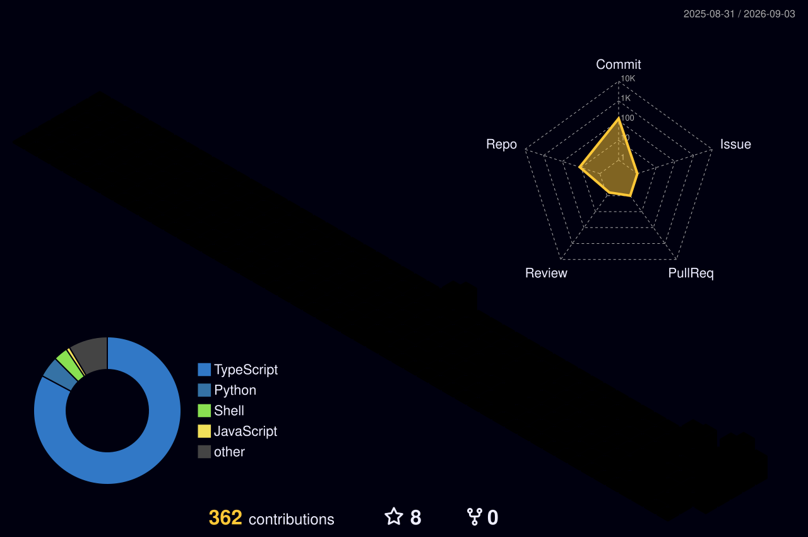

isometric heatmap — your contributions in 3D — <b>night-rainbow</b> (main) · daily via <code>3d-heatmap.yml</code>

<b>▶ All 3D variants (10 heatmaps) — click to expand</b>

 
<table>
<tr>
<td align="center" width="50%">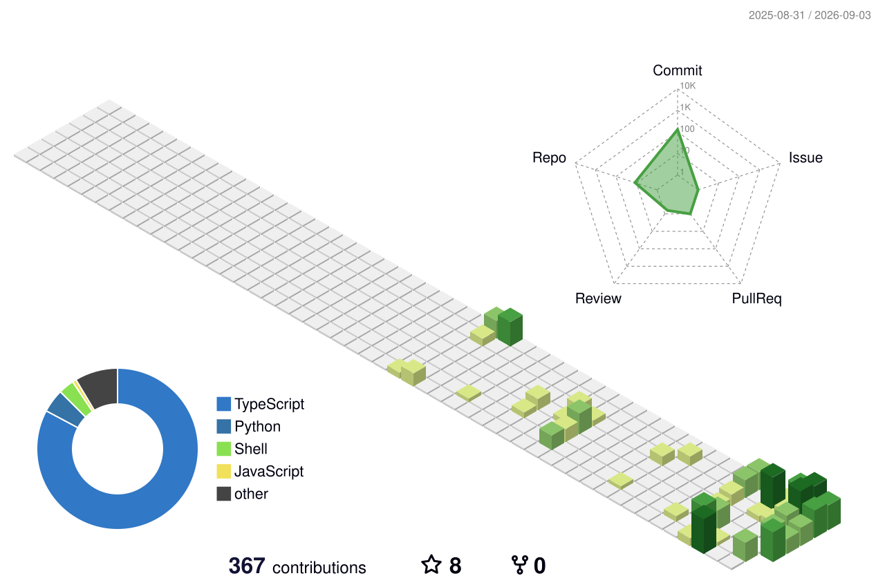 <code>green-animate</code></td>
<td align="center" width="50%"> <code>season-animate</code></td>
</tr>
<tr>
<td align="center">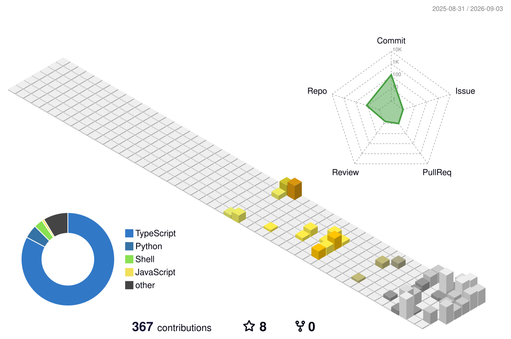 <code>south-season-animate</code></td>
<td align="center">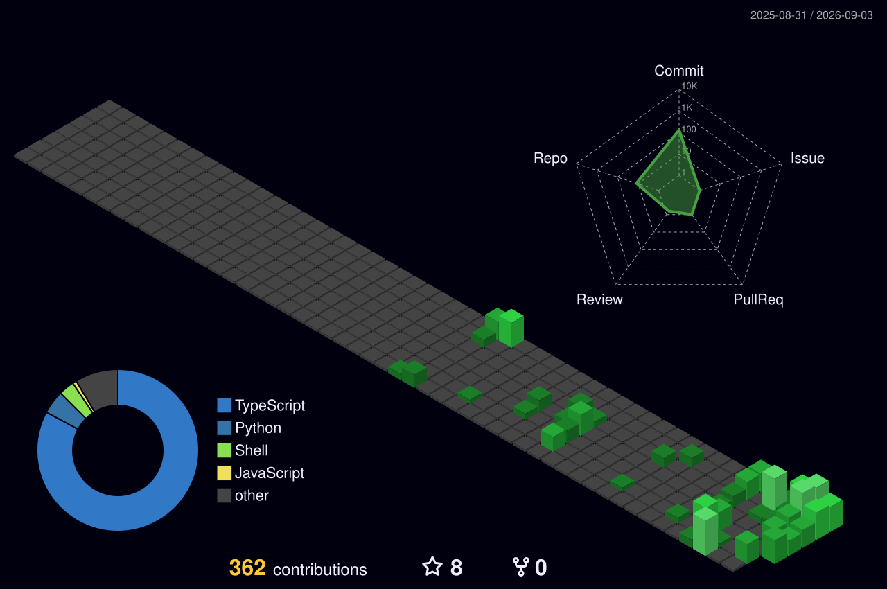 <code>night-green</code></td>
</tr>
<tr>
<td align="center"> <code>green</code></td>
<td align="center">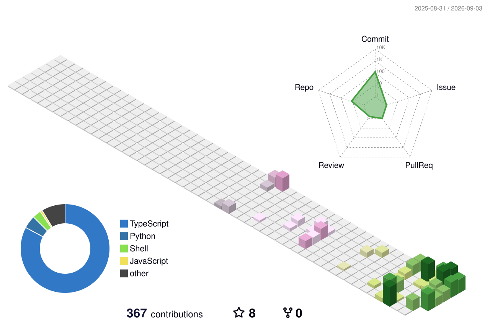 <code>season</code></td>
</tr>
<tr>
<td align="center"> <code>south-season</code></td>
<td align="center">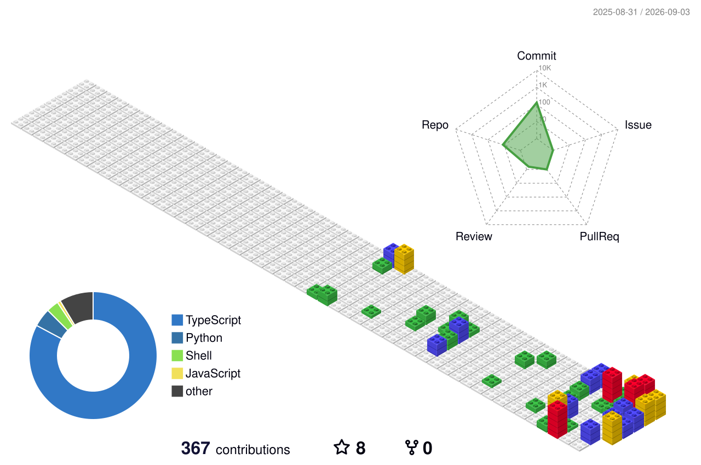 <code>gitblock</code></td>
</tr>
</table>

All generated in <code>profile-3d-contrib/</code> — every push + daily 18:00 UTC. Also <code>profile-night-view.svg</code> in folder.

 

<!-- Arcade heatmaps — all 6 games, generated via pacman.yml -->

<h4 style="color:#E8E8EE;margin:8px 0">🎮 Arcade heatmaps — every game on your contributions</h4>

All 6 games from <code>pacman-contribution-graph</code> — same heatmap data, different arcade physics. Daily via <code>pacman.yml</code>.

<table>
<tr>
<td align="center" width="50%">
<picture>
  <source media="(prefers-color-scheme: dark)" srcset="dist/pacman-contribution-graph-dark.svg"/>
  
</picture>
 <code>pacman</code> · chomps quartiles
</td>
<td align="center" width="50%">
<picture>
  <source media="(prefers-color-scheme: dark)" srcset="dist/breakout-contribution-graph-dark.svg"/>
  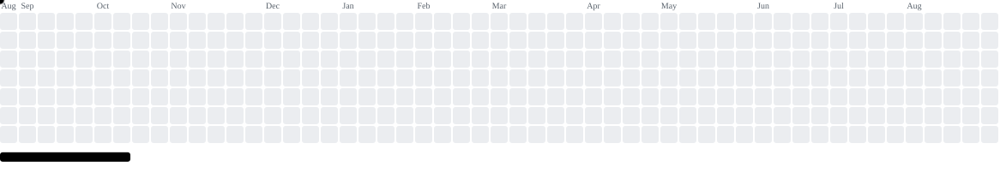
</picture>
 <code>breakout</code> · bricks = days
</td>
</tr>
<tr>
<td align="center">
<picture>
  <source media="(prefers-color-scheme: dark)" srcset="dist/galaga-contribution-graph-dark.svg"/>
  
</picture>
 <code>galaga</code> · shooter
</td>
<td align="center">
<picture>
  <source media="(prefers-color-scheme: dark)" srcset="dist/puzzle-bobble-contribution-graph-dark.svg"/>
  
</picture>
 <code>puzzle-bobble</code> · bubble pop
</td>
</tr>
<tr>
<td align="center">
<picture>
  <source media="(prefers-color-scheme: dark)" srcset="dist/bomberman-contribution-graph-dark.svg"/>
  
</picture>
 <code>bomberman</code> · blast cells
</td>
<td align="center">
<picture>
  <source media="(prefers-color-scheme: dark)" srcset="dist/minesweeper-contribution-graph-dark.svg"/>
  
</picture>
 <code>minesweeper</code> · solver
</td>
</tr>
</table>

Arcade suite: <code>pacman,breakout,galaga,puzzle-bobble,bomberman,minesweeper</code> — light + dark SVGs in <code>dist/</code>

  <picture>
    <source media="(prefers-color-scheme: dark)" srcset="assets/snake-dark.svg"/>
    
  </picture>

snake — classic eats-the-graph — via <code>snake.yml</code> (Platane/snk, custom palette #7A5CFA→#00D9FF)

  

wave heatmap — custom 37×7 pulse grid, wave animates column-by-column — local <code>wave-heatmap.svg</code>

<!-- City skyline + gravity + ghchart — extra heatmap animations -->

  

gitcity skyline — 3D city via <code>gitcity.natrajx.in</code> <code>theme=aurora</code> · <a href="https://gitcity.natrajx.in/vaibhxvvy">interactive</a>

  

isometric API — cached PNG city <code>spectrewolf8/isometric-contributions-embeds</code> <code>theme=neon</code>

  

ghchart — classic 52-week heatmap <code>ghchart.rshah.org</code> custom color <code>0A0A0F</code>

  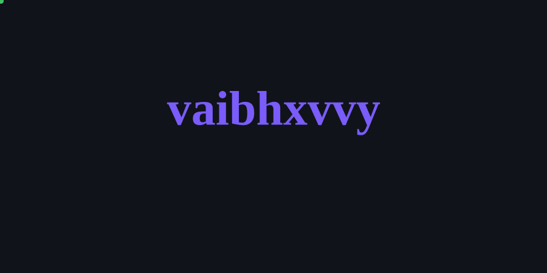

gravity — contributions fall into <code>vaibhxvvy</code> text (flycran/github-gravity) via <code>gravity.yml</code>

<!-- metrics isocalendar — generated via metrics.yml -->

  

metrics isocalendar — half-year calendar heatmap + habits + languages — daily via <code>metrics.yml</code> (requires <code>METRICS_TOKEN</code> or falls back to <code>GITHUB_TOKEN</code>)

<!-- ============================================================ -->
<!-- DONATE — only on last section, as requested -->

SUPPORT

<h4 style="margin:6px 0 4px 0">If my work helped you — a coffee keeps the pipeline running.</h4>

Open-source is free, but not free to make. Thanks for fuelling it.

custom dark · 0A0A0F / 7A5CFA → 00D9FF · animated pipeline + typing + 3D heatmap + pacman heatmap + activity · single-page scrolly

